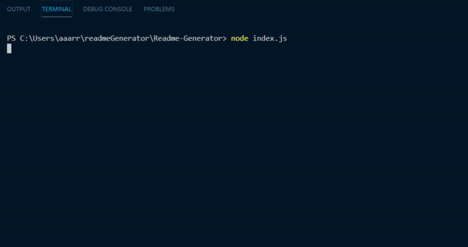

# Application:
Readme-Generator

## Description:
Readme-Generator

## Table of Contents:
  [Intallation Steps](#installSteps)  

  [Instructions](#instructions)  

  [License](#license)  

  [Contributing](#contributing)  

  [Tests](#tests)  

  [Questions](#questions)  

  [Video](#video)

## Installation Dependencies:
npm install

## Instructions:
Follow the prompts, a readme.md file will be created in the current directory.

## License:
None

## Contributing Information:
contact author

## Tests:
no test scripts

## Questions:

If you have any questions, open an issue or contact rureed at undefined.

## Video:

